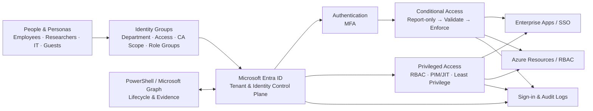

# Enterprise Entra Identity & Access Lab

Designing, implementing and validating a secure identity and access baseline with Microsoft Entra ID.

> **Scenario:** WEZ – Wirtschafts- und Europaforschungszentrum is a completely fictional economic and European research institute created for this lab. All people, departments, identities and organizational data are synthetic.

## Project Goal

This project goes beyond portal configuration. The objective is to design an enterprise-style identity environment, implement controls, validate expected behavior, deliberately create failures, troubleshoot root causes and document rollback paths.

The portfolio signal is **Junior Cloud / Identity Engineer-ready** — not a claim of production IAM Engineer experience.

## Fictional Organization

**WEZ – Wirtschafts- und Europaforschungszentrum**

A fictional independent research institute with:

- Directorate & Strategy
- Research
  - European Economy & Policy
  - Labour Markets & Social Policy
  - Digital Economy & Innovation
  - Public Finance & Regulation
- IT & Digital Services
- Administration & Finance
- Communications & Knowledge Transfer
- External research guests

### Identity scale

The initial dataset contains **47 directory identities**:

- 38 standard member accounts
- 3 separate privileged admin accounts
- 2 emergency / break-glass accounts
- 4 guest identities

The larger dataset is intentional: enough variation for group-based access, Conditional Access scoping, privileged access, guest lifecycle, Access Reviews and later Joiner–Mover–Leaver automation without turning the lab into meaningless bulk-user creation.

## Architecture v1

The editable source remains in [`diagrams/architecture-v1.drawio`](diagrams/architecture-v1.drawio). GitHub renders the Mermaid version above directly.

## Documentation

- [`docs/00-project-charter.md`](docs/00-project-charter.md)
- [`docs/01-requirements.md`](docs/01-requirements.md)
- [`docs/02-architecture.md`](docs/02-architecture.md)
- [`docs/03-identity-model.md`](docs/03-identity-model.md)
- [`tests/test-matrix.md`](tests/test-matrix.md)
- [`tests/failure-scenarios.md`](tests/failure-scenarios.md)
- [`sanitized-samples/users.csv`](sanitized-samples/users.csv)

## Security / Sanitization Notice

No real employer, internship environment, tenant, person, email address, domain, device, ticket, IP address, GUID, subscription ID, secret or token is used in public project content.

`wez-lab.example` is a documentation-only fictional domain.

## Status

**Phase 0 — Project Foundation**

- [x] Repository foundation
- [x] Project charter
- [x] Requirements v1
- [x] Fictional organization model
- [x] Identity dataset v1
- [x] Architecture v1
- [ ] Tenant implementation
- [ ] Identity and group deployment
