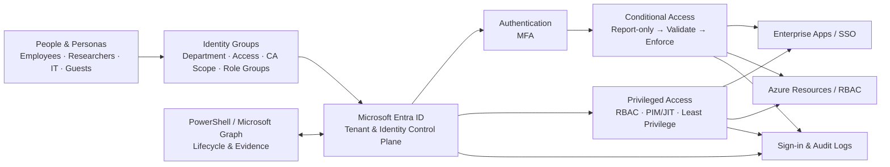

# Enterprise Entra Identity & Access Lab

Designing, implementing and validating a secure identity and access baseline with Microsoft Entra ID.

> **Scenario:** WEZ – Wirtschafts- und Europaforschungszentrum is a completely fictional economic and European research institute created for this lab. All people, departments, identities and organizational data are synthetic.

## Project Goal

This project goes beyond portal configuration. The objective is to design an enterprise-style identity environment, implement controls, validate expected behavior, deliberately create failures, troubleshoot root causes and document rollback paths.

The portfolio signal is **Junior Cloud / Identity Engineer-ready** — not a claim of production IAM Engineer experience.

## Fictional Organization

**WEZ – Wirtschafts- und Europaforschungszentrum**

A fictional independent research institute with:

- Directorate & Strategy
- Research
  - European Economy & Policy
  - Labour Markets & Social Policy
  - Digital Economy & Innovation
  - Public Finance & Regulation
- IT & Digital Services
- Administration & Finance
- Communications & Knowledge Transfer
- External research guests

### Identity scale

The initial dataset contains **47 directory identities**:

- 38 standard member accounts
- 3 separate privileged admin accounts
- 2 emergency / break-glass accounts
- 4 guest identities

The larger dataset is intentional: enough variation for group-based access, Conditional Access scoping, privileged access, guest lifecycle, Access Reviews and later Joiner–Mover–Leaver automation without turning the lab into meaningless bulk-user creation.

## Architecture v1

The editable source remains in [`diagrams/architecture-v1.drawio`](diagrams/architecture-v1.drawio).

## Documentation

- [`docs/00-project-charter.md`](docs/00-project-charter.md)
- [`docs/01-requirements.md`](docs/01-requirements.md)
- [`docs/02-architecture.md`](docs/02-architecture.md)
- [`docs/03-identity-model.md`](docs/03-identity-model.md)
- [`docs/04-authentication-mfa.md`](docs/04-authentication-mfa.md)
- [`docs/05-conditional-access.md`](docs/05-conditional-access.md)
- [`docs/06-emergency-access.md`](docs/06-emergency-access.md)
- [`docs/07-rbac-least-privilege.md`](docs/07-rbac-least-privilege.md)
- [`tests/test-matrix.md`](tests/test-matrix.md)
- [`tests/failure-scenarios.md`](tests/failure-scenarios.md)
- [`sanitized-samples/users.csv`](sanitized-samples/users.csv)

## Security / Sanitization Notice

No real employer, internship environment, tenant, person, email address, domain, device, ticket, IP address, GUID, subscription ID, secret or token is used in public project content.

`wez-lab.example` is a documentation-only fictional domain.

## Current Status

### Phase "Start" — Project Foundation ✅ Complete
- Repository foundation
- Project charter
- Requirements
- Fictional WEZ organization model
- Architecture v1
- Dedicated Microsoft Entra Workforce tenant

### Phase 1 — Identity Model ✅ Complete
- 47 modeled WEZ identities
- Department and security-policy scope groups
- Standard / privileged separation
- Emergency access isolation
- B2B guest model
- Sanitized implementation evidence

### Phase 2 — Authentication & MFA ✅ Complete
- Authentication baseline inventoried
- Workforce Microsoft Authenticator pilot validated
- Number matching validated
- Privileged device-bound Passkeys implemented
- TAP bootstrap / expiry lifecycle validated
- Evidence and test matrix documented

### Phase 3 — Conditional Access & Emergency Access ✅ Complete
- Workforce MFA authentication strength enforced
- Privileged phishing-resistant MFA enforced
- Legacy authentication and Device Code Flow blocking
- Report-only → What If → enforcement rollout
- Emergency exclusion validation
- Controlled privileged failure → RCA → TAP → Passkey → successful retest
- Rollback / recovery documented

### Phase 4 — RBAC & Least Privilege ✅ Complete
- Dedicated Azure Resource Group + low-cost Storage Account lab scope
- Group-based Reader and Contributor role assignments
- Resource Group scoped RBAC with inherited access at the Storage Account
- Reader read access validated
- Reader write denial validated
- No-assignment control identity validated
- Controlled RBAC group-membership failure executed
- Role / scope / membership RCA completed
- Least-privilege membership remediation performed
- Contributor write retest succeeded
- Rollback model documented
- Sanitized evidence package created

### Next
**Phase 5 — PIM / Governance**
