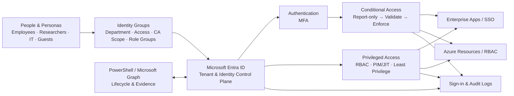

# Enterprise Entra Identity & Access Lab

Designing, implementing and validating a secure identity and access baseline with Microsoft Entra ID.

> **Scenario:** WEZ – Wirtschafts- und Europaforschungszentrum is a completely fictional economic and European research institute created for this lab. All people, departments, identities and organizational data are synthetic.

## Project Goal

This project goes beyond portal configuration. The objective is to design an enterprise-style identity environment, implement controls, validate expected behavior, deliberately create failures, troubleshoot root causes and document rollback paths.

The portfolio signal is **Junior Cloud / Identity Engineer-ready** — not a claim of production IAM Engineer experience.

## Fictional Organization

**WEZ – Wirtschafts- und Europaforschungszentrum**

A fictional independent research institute with:

- Directorate & Strategy
- Research
  - European Economy & Policy
  - Labour Markets & Social Policy
  - Digital Economy & Innovation
  - Public Finance & Regulation
- IT & Digital Services
- Administration & Finance
- Communications & Knowledge Transfer
- External research guests

### Identity scale

The initial dataset contains **47 directory identities**:

- 38 standard member accounts
- 3 separate privileged admin accounts
- 2 emergency / break-glass accounts
- 4 guest identities

## Architecture v1

```mermaid
flowchart LR
    P["People & Personas<br/>Employees · Researchers · IT · Guests"]
    G["Identity Groups<br/>Department · Access · CA Scope · Role Groups"]
    E["Microsoft Entra ID<br/>Tenant & Identity Control Plane"]
    AUTH["Authentication<br/>MFA"]
    CA["Conditional Access<br/>Report-only → Validate → Enforce"]
    PRIV["Privileged Access<br/>RBAC · PIM/JIT · Least Privilege"]
    APPS["Enterprise Apps / SSO"]
    AZ["Azure Resources / RBAC"]
    LOGS["Sign-in & Audit Logs"]
    AUTO["PowerShell / Microsoft Graph<br/>Lifecycle & Evidence"]

    P --> G
    G --> E
    E --> AUTH
    AUTH --> CA
    E --> PRIV
    CA --> APPS
    CA --> AZ
    PRIV --> APPS
    PRIV --> AZ
    E --> LOGS
    CA --> LOGS
    PRIV --> LOGS
    AUTO <--> E
```

## Documentation

- [`docs/00-project-charter.md`](docs/00-project-charter.md)
- [`docs/01-requirements.md`](docs/01-requirements.md)
- [`docs/02-architecture.md`](docs/02-architecture.md)
- [`docs/03-identity-model.md`](docs/03-identity-model.md)
- [`docs/04-authentication-mfa.md`](docs/04-authentication-mfa.md)
- [`docs/05-conditional-access.md`](docs/05-conditional-access.md)
- [`docs/06-emergency-access.md`](docs/06-emergency-access.md)
- [`docs/07-rbac-least-privilege.md`](docs/07-rbac-least-privilege.md)
- [`docs/08-pim-governance.md`](docs/08-pim-governance.md)
- [`docs/09-enterprise-app-sso.md`](docs/09-enterprise-app-sso.md)
- [`diagrams/privileged-access-flow.mmd`](diagrams/privileged-access-flow.mmd)
- [`diagrams/enterprise-app-sso-flow.mmd`](diagrams/enterprise-app-sso-flow.mmd)
- [`tests/test-matrix.md`](tests/test-matrix.md)
- [`tests/failure-scenarios.md`](tests/failure-scenarios.md)
- [`sanitized-samples/users.csv`](sanitized-samples/users.csv)

## Security / Sanitization Notice

The WEZ organization, personas and working identities are synthetic and belong only to this dedicated lab scenario. Public evidence may show lab-only tenant identifiers such as synthetic `onmicrosoft.com` UPNs, application IDs or request/correlation IDs when they are part of troubleshooting evidence.

No production/employer tenant data, personal mailbox data, production device/IP data, ticket data, passwords, Temporary Access Pass values, access/refresh tokens, client secrets, certificate private keys or other live credentials are published.

`wez-lab.example` remains the documentation-only fictional domain used in sanitized examples.

## Current Status

### Phase "Start" — Project Foundation ✅ Complete
- Repository foundation
- Project charter
- Requirements
- Fictional WEZ organization model
- Architecture v1
- Dedicated Microsoft Entra Workforce tenant

### Phase 1 — Identity Model ✅ Complete
- 47 modeled WEZ identities
- Department and security-policy scope groups
- Standard / privileged separation
- Emergency access isolation
- B2B guest model
- Sanitized implementation evidence

### Phase 2 — Authentication & MFA ✅ Complete
- Authentication baseline inventoried
- Workforce Microsoft Authenticator pilot validated
- Number matching validated
- Privileged device-bound Passkeys implemented
- TAP bootstrap / expiry lifecycle validated
- Evidence and test matrix documented

### Phase 3 — Conditional Access & Emergency Access ✅ Complete
- Workforce MFA authentication strength enforced
- Privileged phishing-resistant MFA enforced
- Legacy authentication and Device Code Flow blocking
- Report-only → What If → enforcement rollout
- Emergency exclusion validation
- Controlled privileged failure → RCA → TAP → Passkey → successful retest
- Rollback / recovery documented

### Phase 4 — RBAC & Least Privilege ✅ Complete
- Dedicated Azure Resource Group + low-cost Storage Account lab scope
- Group-based Reader and Contributor role assignments
- Resource Group scoped RBAC with inherited access at the Storage Account
- Reader read / write boundary validated
- No-assignment control validated
- Controlled RBAC group-membership failure → RCA → least-privilege remediation → successful retest

### Phase 5 — PIM / Governance ✅ Complete
- Existing group-based Azure RBAC model preserved
- Standing Contributor-group membership converted to PIM eligibility
- 1-hour JIT activation policy
- MFA, business justification and approval required
- Two approvers configured
- Pre-activation access denial validated
- Approval-based activation validated
- Temporary Contributor access restored through active group membership
- Management-plane write validated during activation
- PIM user audit history captured
- Manual deactivation validated
- Post-deactivation access denial validated
- Governance / periodic eligibility-review model documented
- Access Review execution is not claimed

### Phase 6 — Enterprise App / SSO ✅ Complete
- Microsoft Entra gallery application integrated as **WEZ Research Collaboration Portal**
- SAML 2.0 federation configured with Entra ID as Identity Provider
- Group-based application assignment through `GRP-APP-RESEARCH-PORTAL-USERS`
- `Assignment required = Yes` enforced
- Lisa Werner positive SP-initiated SSO validated
- Entra Sign-in Log success captured
- Mia Schneider unassigned test produced `AADSTS50105`
- Sign-in-log RCA isolated the failure to missing application assignment
- Group-membership remediation restored access without weakening the application control
- Service Provider local-user mapping dependency observed and resolved
- My Apps launch path validated
- `department` and `jobTitle` SAML claims configured
- Temporary Mia access removed after validation; least-privilege final state restored
- Raw custom-claim assertion decoding is not claimed

### Next
**Phase 7 — Project-1 PowerShell / Microsoft Graph layer**
