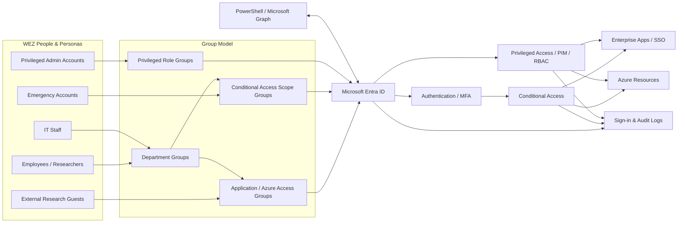

# Architecture

## Version
`architecture-v1`

## Objective
Model a realistic identity control plane for the fictional **WEZ – Wirtschafts- und Europaforschungszentrum**.

## Overall Identity Architecture

## Design Decisions
1. Business access is group-driven rather than assigned directly to users.
2. Standard and privileged accounts are separated.
3. Conditional Access is treated as a staged control plane, not a checkbox.
4. Sign-in and Audit Logs are part of the architecture for validation and RCA.
5. The identity dataset is structured so later Graph/PowerShell automation can consume it.

## Draw.io Source
`diagrams/architecture-v1.drawio`

GitHub shows Draw.io XML as text when opening the raw source. That is normal. The Mermaid diagram above is the GitHub-native visual representation.

## Next Revision
Create `architecture-v2` after users, groups and the first role model are actually deployed and tested. Keep v1 for evidence.
