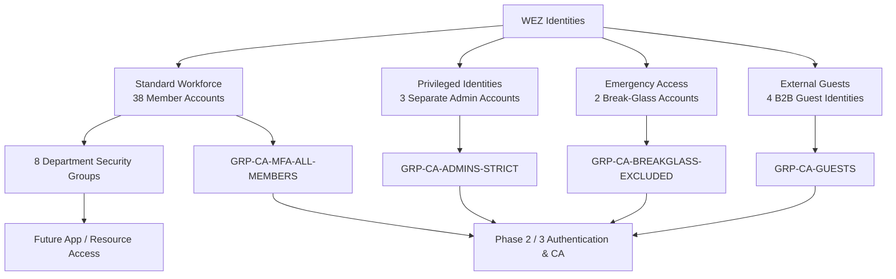

# Identity Model

## Objective

Design and implement a realistic Microsoft Entra identity model for the fictional WEZ research institute. The goal is not to maximize object count, but to create meaningful IAM variation across standard users, privileged identities, emergency access accounts, external guests, department membership and future policy scopes.

## Identity Population

WEZ v1 contains **47 directory identities**:

| Identity class | Count | Purpose |
|---|---:|---|
| Standard member accounts | 38 | Daily workforce identities |
| Separate privileged admin accounts | 3 | Dedicated administrative operations |
| Emergency / break-glass accounts | 2 | Tenant recovery and emergency access |
| Guest identities | 4 | External research collaboration |
| **Total** | **47** | |

The public sample data uses sanitized values in `sanitized-samples/users.csv`.

> **Operational tenant note:** The Microsoft Entra portal shows **48 total users** in the Phase 1 evidence because the tenant contains the 47 modeled WEZ identities **plus one bootstrap lab administrator account** used to manage the environment. That bootstrap account is outside the fictional WEZ workforce model and is excluded from the public synthetic dataset.

## Organizational Structure

- Directorate & Strategy
- Research
  - European Economy & Policy
  - Labour Markets & Social Policy
  - Digital Economy & Innovation
  - Public Finance & Regulation
- IT & Digital Services
- Administration & Finance
- Communications & Knowledge Transfer
- External Research Guests

## Design Decision 1 — Standard and Privileged Account Separation

Administrative staff use separate daily-work and privileged identities.

```text
Sarah Klein
├── sarah.klein@wez-lab.example
│   └── normal daily work identity
└── admin.sarah.klein@wez-lab.example
    └── dedicated privileged identity
```

The privileged account keeps the employee's organizational department (`IT & Digital Services`) but is separated by naming, persona and security scope. Privileged identities are not placed in normal department groups.

**Why:** This reduces accidental use of elevated permissions and creates a clear boundary for stricter authentication, Conditional Access and later PIM controls.

## Design Decision 2 — Department Groups

Department membership is represented with dedicated Security groups:

| Group | Department |
|---|---|
| `GRP-DEP-DIR` | Directorate & Strategy |
| `GRP-DEP-RES-EU` | Research / European Economy & Policy |
| `GRP-DEP-RES-LAB` | Research / Labour Markets & Social Policy |
| `GRP-DEP-RES-DIG` | Research / Digital Economy & Innovation |
| `GRP-DEP-RES-PFR` | Research / Public Finance & Regulation |
| `GRP-DEP-IT` | IT & Digital Services |
| `GRP-DEP-AF` | Administration & Finance |
| `GRP-DEP-COMMS` | Communications & Knowledge Transfer |

These groups contain standard workforce identities only.

## Design Decision 3 — Conditional Access Scope Groups

Phase 1 prepares four Security groups that become policy scopes in later phases:

| Group | Purpose |
|---|---|
| `GRP-CA-MFA-ALL-MEMBERS` | Baseline MFA scope for standard workforce |
| `GRP-CA-ADMINS-STRICT` | Stricter controls for dedicated privileged identities |
| `GRP-CA-GUESTS` | Guest-specific Conditional Access scope |
| `GRP-CA-BREAKGLASS-EXCLUDED` | Controlled emergency-access exclusion scope |

No Conditional Access policy is implemented in Phase 1. Phase 1 establishes the identity and group boundaries required for Phase 2 and Phase 3.

## Design Decision 4 — Emergency Access Accounts

Two dedicated emergency identities are maintained:

- `emergency.admin01@wez-lab.example`
- `emergency.admin02@wez-lab.example`

Both are isolated in `GRP-CA-BREAKGLASS-EXCLUDED`.

**Why:** Emergency access must remain logically separate from normal workforce and privileged-administration policy scopes. Exclusion design, validation and monitoring are implemented in Phase 3.

## Design Decision 5 — External Guests Use B2B Guest Objects

Four external research collaborators are represented as **Guest** identities rather than internal Member accounts:

- Elena Rossi — Visiting Researcher
- Pierre Laurent — Visiting Researcher
- Marta Kowalska — External Research Partner
- Tomás García — External Research Partner

They are scoped through `GRP-CA-GUESTS`.

The lab objects are created without sending real invitation messages. Redemption and real sign-in testing are deferred to the Enterprise Application / SSO phase with a controlled external test identity.

## Design Decision 6 — Administrative Units Not Used in v1

Administrative Units are intentionally excluded from Phase 1.

**Reason:** The current WEZ scenario does not require scoped regional, legal-entity or delegated administrative boundaries. Adding Administrative Units would create complexity without a concrete requirement.

## Design Decision 7 — Manual First, Bulk Second

A small number of identities and groups were created manually first to understand the Entra object model and verify the design. The remaining standard workforce identities were then created through Microsoft Entra bulk CSV import.

**Why:** This balances hands-on understanding with repeatability and avoids turning Phase 1 into an automation-only exercise. PowerShell and Microsoft Graph automation are handled in Phase 7.

## Implemented Group Model

Phase 1 ends with **12 implemented Security groups**, all using Assigned membership:

```text
Department groups: 8
Conditional Access scope groups: 4
Total: 12
```

Application-access groups, Azure RBAC groups and PIM/role-assignable groups are intentionally deferred until the phase where the corresponding resource or governance control exists.

## Identity / Role Model v1



## Validation Performed in Phase 1

- Standard and privileged Sarah Klein identities exist as separate objects.
- Privileged identities are grouped separately from standard workforce identities.
- Two emergency identities exist and are isolated in the break-glass scope group.
- Four external collaborators exist as Guest identities.
- Eight department groups represent the organizational structure.
- Four Conditional Access scope groups establish future policy boundaries.
- The final All Groups view contains 12 Phase 1 groups.

## Evidence

The following sanitized screenshots provide implementation evidence for Phase 1:

| Evidence | What it proves |
|---|---|
| [`01-all-users.png`](../images/01-identity-model/01-all-users.png) | Workforce, privileged, emergency and guest identities exist in the tenant. The portal count includes the separate bootstrap lab administrator noted above. |
| [`02-all-groups.png`](../images/01-identity-model/02-all-groups.png) | The 12 Phase 1 Security groups exist with Assigned membership. |
| [`03-privileged-admin-group.png`](../images/01-identity-model/03-privileged-admin-group.png) | Three dedicated privileged identities are isolated in `GRP-CA-ADMINS-STRICT`. |
| [`04-breakglass-group.png`](../images/01-identity-model/04-breakglass-group.png) | Two emergency identities are isolated in `GRP-CA-BREAKGLASS-EXCLUDED`. |
| [`05-guest-group.png`](../images/01-identity-model/05-guest-group.png) | Four external collaborators exist as Guest identities and are scoped through `GRP-CA-GUESTS`. |

Sensitive tenant-specific identifiers and operator information are sanitized in the public evidence.

## Deferred to Later Phases

- MFA implementation → Phase 2
- Conditional Access policy implementation and emergency exclusions → Phase 3
- Azure RBAC access groups → Phase 4
- PIM / role-assignable groups and governance → Phase 5
- Enterprise application access groups / SSO → Phase 6
- PowerShell / Microsoft Graph automation → Phase 7

## Lessons Learned

1. Identity design quality comes from meaningful boundaries and personas, not from creating hundreds of users.
2. A privileged account is an account class, not an organizational department.
3. Department membership, policy scope and privileged access should be modeled as separate concepts.
4. Security groups should be created when they serve a defined control or requirement; unused groups add noise.
5. Creating a few objects manually before bulk provisioning makes later automation easier to validate.
